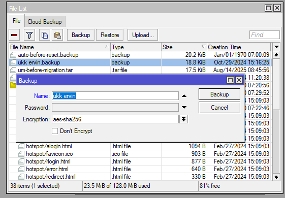
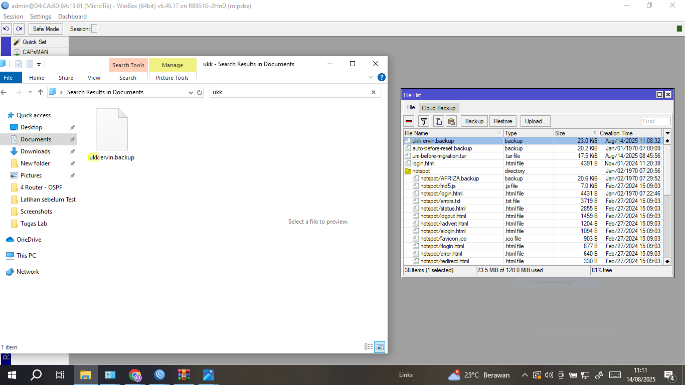
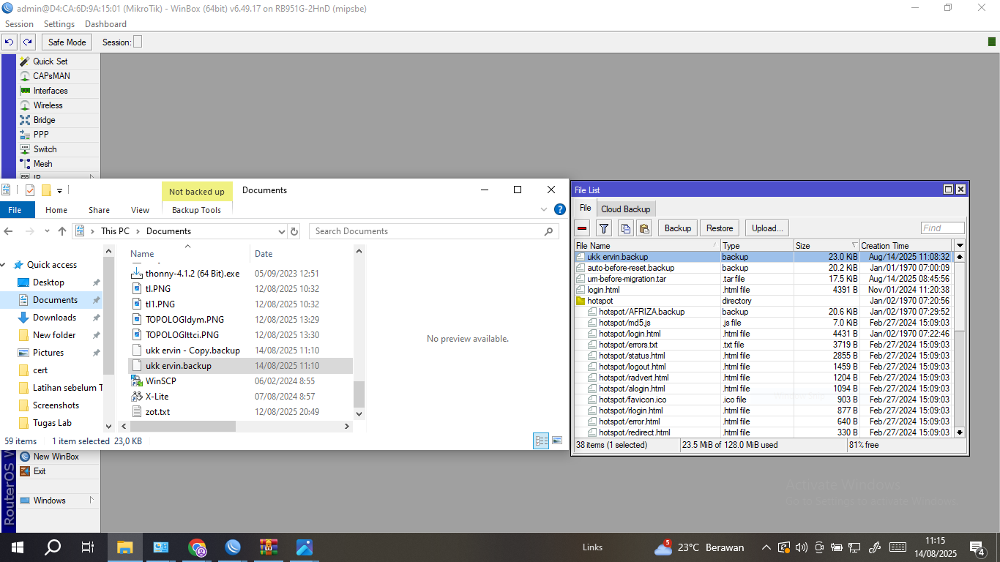

# LAB-11-Backup-dan-restore-pada-mikrotik
TANGGAL 14 AGUSTUS 2025
# backup dan restore pada mikrotik 
Backup dan restore adalah fitur penting pada router Mikrotik untuk menyimpan dan mengembalikan konfigurasi router.  
Backup digunakan untuk mencadangkan pengaturan router, sementara restore digunakan untuk mengembalikan  
router ke konfigurasi sebelumnya dari file backup. Ini berguna untuk menghindari kehilangan data  
konfigurasi jika terjadi masalah pada router atau ketika ingin memindahkan konfigurasi ke router lain.  

**langkah langkah nya**
1. buka menu file di winbox, pilih file yang mau di backup lalu klik backup 

   

atau via CLI:

        /system backup save name="basic-config"

Namun belum cukup disitu saja, konfigurasi memang telah terbackup namun file backup masih tersimpan di storage router.  
Jika router diinstall ulang dengan NetInstall file backup akan ilang karna proses Netinstall melakukan format storage router.  
Agar tidak hilang, pindahkan file backup ke windows, bisa langsung di drag dari winbox dan drop ke windows.  

Selain drag and drop kita juga bisa mengunakan FileZilla,  Jika suatu saat ingin kembali ke konfig sebelumnya,  
bisa masuk ke Files di Winbox dan klik Upload lalu cari dan pilih file backup ke router, kemudian klik Restore.  
Atau bisa juga langsung Drag&Dron file dari WInExplor ke Files WInbox.  

# kesimpulan
Backup dan Restore pada MikroTik adalah metode penting untuk menjaga keamanan, kestabilan, dan kemudahan pemulihan sistem jaringan.
Pengguna dapat memilih metode .backup untuk pencadangan penuh, atau .rsc untuk fleksibilitas dan migrasi antar perangkat.
   
